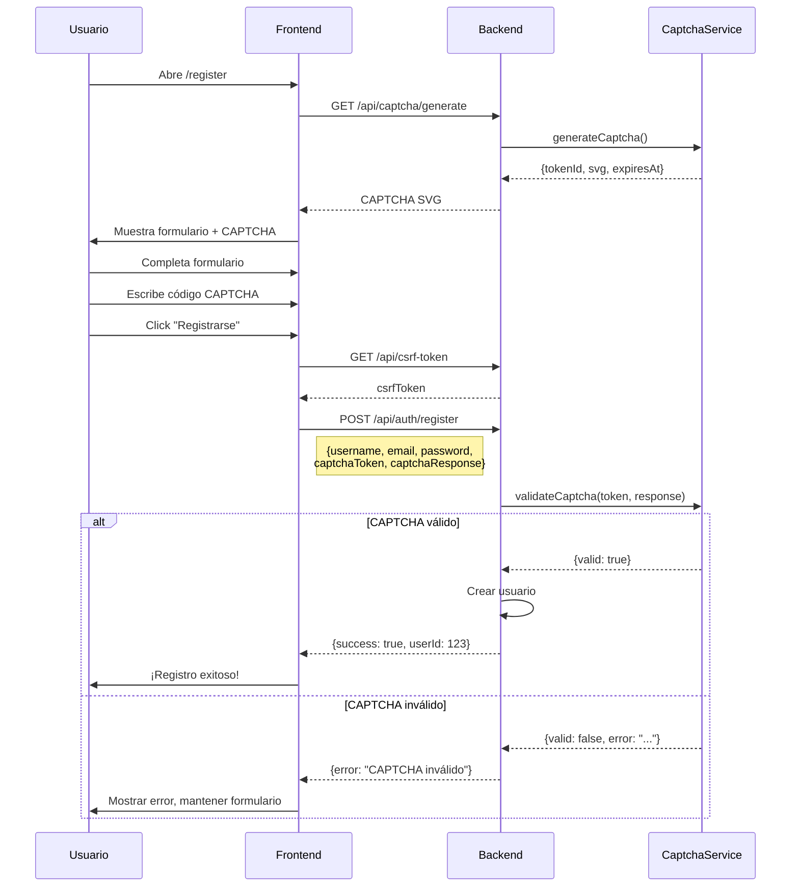

# Guía Completa de Implementación CAPTCHA

## 🎯 Resumen Ejecutivo

Se ha implementado exitosamente un sistema completo de CAPTCHA usando `svg-captcha` para proteger el registro de usuarios contra bots y automatización maliciosa.

### ✅ Características Implementadas

- **Backend**: Generación y validación de CAPTCHA en Node.js/Express
- **Frontend**: Componente React reutilizable con UI moderna
- **Seguridad**: Tokens únicos, expiración automática, rate limiting
- **UX**: Carga automática, recarga manual, feedback en tiempo real
- **Documentación**: 3 documentos completos con ejemplos y troubleshooting

---

## 📦 Componentes del Sistema

### Backend (Node.js/Express)

```
app/
├── services/captchaService.js    # Lógica de negocio
├── routes/captcha.js             # Endpoints HTTP
├── middleware/captcha.js         # Validación middleware
└── routes/auth.js                # Integración en registro
```

### Frontend (React/TypeScript)

```
frontend/src/
├── components/Captcha.tsx        # Componente reutilizable
└── pages/RegisterPage.tsx        # Página de registro (integrado)
```

### Documentación

```
├── CAPTCHA_IMPLEMENTATION.md           # Guía backend
├── CAPTCHA_FRONTEND_INTEGRATION.md     # Guía frontend
├── CAPTCHA_COMPLETE_GUIDE.md           # Este documento
└── test_captcha.sh                     # Script de pruebas
```

---

## 🚀 Inicio Rápido

### Para Desarrolladores

1. **Backend ya configurado** ✅
   - Dependencia `svg-captcha` instalada
   - Endpoints disponibles en `/api/captcha/*`
   - Validación integrada en `/api/auth/register`

2. **Frontend ya configurado** ✅
   - Componente `Captcha` creado
   - Integrado en página de registro
   - Estilos Tailwind aplicados

3. **Probar la implementación**:
   ```bash
   # Probar backend
   ./test_captcha.sh

   # Probar frontend
   # Navegar a http://localhost:3001/register
   ```

### Para Testing

```bash
# Test automático del backend
chmod +x test_captcha.sh
./test_captcha.sh

# Test manual del flujo completo
1. Abrir http://localhost:3001/register
2. Llenar formulario de registro
3. Verificar que CAPTCHA se muestre
4. Escribir código CAPTCHA
5. Enviar formulario
6. Verificar registro exitoso
```

---

## 📚 Documentación por Rol

### Backend Developer
👉 Lee `CAPTCHA_IMPLEMENTATION.md`

Aprenderás:
- Cómo funciona el servicio de CAPTCHA
- Endpoints disponibles y sus parámetros
- Cómo integrar en otros endpoints
- Configuración y seguridad

### Frontend Developer
👉 Lee `CAPTCHA_FRONTEND_INTEGRATION.md`

Aprenderás:
- Cómo usar el componente `Captcha`
- Props y eventos disponibles
- Manejo de estados y errores
- Personalización de estilos

### QA / Testing
👉 Usa `test_captcha.sh` y este documento

Casos de prueba:
- ✅ CAPTCHA se genera correctamente
- ✅ CAPTCHA se puede recargar
- ✅ Validación rechaza códigos incorrectos
- ✅ Validación rechaza tokens expirados
- ✅ Registro exitoso con CAPTCHA correcto

---

## 🔄 Flujo Completo End-to-End



---

## 🎨 Vista Previa de UI

### Desktop (1024px+)
```
┌─────────────────────────────────────────────┐
│           Crear Cuenta                      │
│     Regístrate para acceder al sistema      │
├─────────────────────────────────────────────┤
│                                             │
│  Nombre de Usuario                          │
│  ┌─────────────────────────────────────┐   │
│  │ usuario123                          │   │
│  └─────────────────────────────────────┘   │
│  ✓ Nombre de usuario disponible            │
│                                             │
│  Email                                      │
│  ┌─────────────────────────────────────┐   │
│  │ tu@email.com                        │   │
│  └─────────────────────────────────────┘   │
│                                             │
│  Contraseña                                 │
│  ┌─────────────────────────────────────┐   │
│  │ ••••••••                        👁️ │   │
│  └─────────────────────────────────────┘   │
│  ████████░░ Fuerte                          │
│                                             │
│  Confirmar Contraseña                       │
│  ┌─────────────────────────────────────┐   │
│  │ ••••••••                        👁️ │   │
│  └─────────────────────────────────────┘   │
│  ✓ Las contraseñas coinciden                │
│                                             │
│  Verificación CAPTCHA               🔄      │
│  ┌─────────────────────────────────────┐   │
│  │                                     │   │
│  │     [CAPTCHA SVG aquí]              │   │
│  │                                     │   │
│  └─────────────────────────────────────┘   │
│  ┌─────────────────────────────────────┐   │
│  │ Ingresa el código...                │   │
│  └─────────────────────────────────────┘   │
│  El CAPTCHA expira en 5 minutos             │
│                                             │
│  ┌───────────────────────────────────────┐ │
│  │        Registrarse                    │ │
│  └───────────────────────────────────────┘ │
│                                             │
│  ¿Ya tienes una cuenta? Inicia sesión      │
└─────────────────────────────────────────────┘
```

### Mobile (375px)
```
┌──────────────────────┐
│   Crear Cuenta       │
├──────────────────────┤
│                      │
│  Nombre de Usuario   │
│  ┌────────────────┐  │
│  │ usuario123     │  │
│  └────────────────┘  │
│                      │
│  Email               │
│  ┌────────────────┐  │
│  │ email@...      │  │
│  └────────────────┘  │
│                      │
│  Contraseña          │
│  ┌────────────────┐  │
│  │ ••••••     👁️ │  │
│  └────────────────┘  │
│                      │
│  Confirmar           │
│  ┌────────────────┐  │
│  │ ••••••     👁️ │  │
│  └────────────────┘  │
│                      │
│  CAPTCHA       🔄    │
│  ┌────────────────┐  │
│  │ [SVG]          │  │
│  └────────────────┘  │
│  ┌────────────────┐  │
│  │ Código...      │  │
│  └────────────────┘  │
│                      │
│  ┌──────────────┐    │
│  │ Registrarse  │    │
│  └──────────────┘    │
└──────────────────────┘
```

---

## 🔧 Configuración

### Variables de Entorno

Agrega al archivo `.env`:

```bash
# Habilitar/deshabilitar CAPTCHA
CAPTCHA_REQUIRED=true

# Para desarrollo (deshabilitar CAPTCHA)
# CAPTCHA_REQUIRED=false
```

### Configuración del Backend

```javascript
// app/services/captchaService.js
const captcha = svgCaptcha.create({
  size: 6,              // Caracteres (4-8)
  noise: 3,             // Nivel de ruido (1-10)
  color: true,          // Colores aleatorios
  background: '#ffffff',
  width: 250,           // Ancho del SVG
  height: 100,          // Alto del SVG
  ignoreChars: '0oO1ilI' // Caracteres excluidos
});
```

### Configuración del Frontend

```tsx
// frontend/src/components/Captcha.tsx

// Cambiar a CAPTCHA matemático
const response = await fetch('/api/captcha/generate?type=math');

// Cambiar tamaño
const response = await fetch('/api/captcha/generate?size=8');
```

---

## 🧪 Testing Completo

### 1. Tests Backend

```bash
# Ejecutar script de pruebas
./test_captcha.sh

# Output esperado:
# ✓ Endpoint de generación funciona
# ✓ CAPTCHA texto generado
# ✓ CAPTCHA matemático generado
# ✓ Estadísticas disponibles
# ✓ Validación rechaza CAPTCHA incorrecto
```

### 2. Tests Frontend

#### Test Manual
1. Abrir http://localhost:3001/register
2. Verificar que CAPTCHA se carga automáticamente
3. Click en botón 🔄 para recargar
4. Escribir código CAPTCHA
5. Completar otros campos
6. Submit → Verificar registro exitoso

#### Test de Error
1. Escribir código incorrecto
2. Submit
3. Verificar error: "CAPTCHA incorrecto"
4. Verificar que formulario no se limpie
5. CAPTCHA NO debe recargarse automáticamente

### 3. Tests de Integración

```bash
# Test completo del flujo
curl -s http://localhost:3000/api/captcha/generate | jq -r '.tokenId' > /tmp/token.txt
CAPTCHA_TOKEN=$(cat /tmp/token.txt)

# Registrar usuario con CAPTCHA
CSRF=$(curl -s http://localhost:3000/api/csrf-token | jq -r '.csrfToken')
curl -X POST http://localhost:3000/api/auth/register \
  -H "Content-Type: application/json" \
  -H "X-CSRF-Token: $CSRF" \
  -d "{
    \"username\": \"test_$(date +%s)\",
    \"email\": \"test@example.com\",
    \"password\": \"Test123!\",
    \"captchaToken\": \"$CAPTCHA_TOKEN\",
    \"captchaResponse\": \"CODIGO_DEL_SVG\"
  }"
```

---

## 🐛 Troubleshooting

### Problema: CAPTCHA no se muestra en el frontend

**Síntomas**: Spinner infinito o mensaje de error

**Soluciones**:
1. Verificar que el backend esté corriendo:
   ```bash
   curl http://localhost:3000/api/captcha/generate
   ```

2. Verificar CORS:
   ```bash
   # En app/app.js, verificar ALLOWED_ORIGINS
   ALLOWED_ORIGINS=http://localhost:3001
   ```

3. Revisar logs del backend:
   ```bash
   docker logs nodejs --tail 50
   ```

### Problema: Error "CAPTCHA requerido" al enviar formulario

**Síntomas**: Formulario válido pero backend rechaza

**Soluciones**:
1. Verificar que `captchaToken` y `captchaResponse` se envíen:
   ```javascript
   console.log({captchaToken, captchaResponse});
   ```

2. Verificar payload en DevTools → Network → Request Body

3. Verificar que CAPTCHA_REQUIRED no esté en false

### Problema: CAPTCHA siempre dice "incorrecto"

**Síntomas**: Código correcto pero backend rechaza

**Soluciones**:
1. Verificar que el código no tenga espacios:
   ```javascript
   captchaResponse.trim()
   ```

2. Revisar logs del backend:
   ```bash
   docker exec nodejs cat /app/logs/*.log
   ```

3. Verificar que el token no haya expirado (5 min)

### Problema: SVG no se renderiza

**Síntomas**: Espacio en blanco donde debería estar CAPTCHA

**Soluciones**:
1. Verificar Content Security Policy en `app/app.js`
2. Revisar que el SVG sea válido (no contenga scripts)
3. Verificar que `dangerouslySetInnerHTML` esté permitido

---

## 📊 Monitoreo y Métricas

### Estadísticas de CAPTCHA

```bash
# Obtener estadísticas actuales
curl http://localhost:3000/api/captcha/stats | jq

# Output:
# {
#   "totalStored": 15,
#   "expired": 2
# }
```

### Métricas Recomendadas

1. **Tasa de éxito de CAPTCHA**:
   - % de usuarios que completan CAPTCHA correctamente
   - Meta: >85%

2. **Tiempo promedio de resolución**:
   - Tiempo desde carga hasta submit
   - Meta: <30 segundos

3. **Recargas de CAPTCHA**:
   - Número de veces que usuarios recargan
   - Meta: <2 recargas promedio

4. **Tasa de abandono**:
   - % de usuarios que abandonan en CAPTCHA
   - Meta: <5%

### Implementar Analytics

```typescript
// En Captcha.tsx
import analytics from '@/lib/analytics';

const loadCaptcha = async () => {
  const startTime = Date.now();

  // ... cargar CAPTCHA

  analytics.track('captcha_loaded', {
    loadTime: Date.now() - startTime,
    type: data.type
  });
};

// En RegisterPage.tsx
const handleSubmit = async () => {
  // ... validar y enviar

  if (response.ok) {
    analytics.track('captcha_success', {
      attempts: attemptCount
    });
  } else if (data.captchaRequired) {
    analytics.track('captcha_failed', {
      error: data.error
    });
  }
};
```

---

## 🚀 Mejoras Futuras

### Corto Plazo (1-2 semanas)
- [ ] Agregar tests unitarios para componente Captcha
- [ ] Implementar CAPTCHA en otros formularios (cambio de password)
- [ ] Agregar animación de transición al cambiar CAPTCHA
- [ ] Mostrar temporizador de expiración

### Mediano Plazo (1 mes)
- [ ] Migrar almacenamiento a Redis para escalabilidad
- [ ] Implementar CAPTCHA adaptativo (más difícil con fallos)
- [ ] Agregar CAPTCHA de audio para accesibilidad
- [ ] Tests E2E con Playwright

### Largo Plazo (3 meses)
- [ ] Evaluar alternativas (reCAPTCHA, hCaptcha)
- [ ] Implementar análisis de comportamiento (honeypot)
- [ ] Sistema de reputación de usuarios
- [ ] A/B testing de diferentes tipos de CAPTCHA

---

## 📖 Referencias

### Documentación del Proyecto
- [Backend Implementation](./CAPTCHA_IMPLEMENTATION.md) - Detalles técnicos del backend
- [Frontend Integration](./CAPTCHA_FRONTEND_INTEGRATION.md) - Guía de frontend
- [Test Script](./test_captcha.sh) - Script de pruebas automatizadas

### Recursos Externos
- [svg-captcha GitHub](https://github.com/lepture/captcha) - Biblioteca usada
- [OWASP CAPTCHA Guide](https://cheatsheetseries.owasp.org/cheatsheets/CAPTCHA_Cheat_Sheet.html) - Mejores prácticas
- [Web Accessibility Initiative](https://www.w3.org/WAI/WCAG21/Understanding/captcha) - Accesibilidad

### API Endpoints
```
GET  /api/captcha/generate     # Generar CAPTCHA
GET  /api/captcha/stats        # Estadísticas
POST /api/auth/register        # Registro con CAPTCHA
```

---

## 👥 Soporte

### Preguntas Frecuentes

**¿El CAPTCHA distingue mayúsculas/minúsculas?**
No, la validación es case-insensitive para mejor UX.

**¿Cuánto tiempo dura un CAPTCHA?**
5 minutos desde su generación.

**¿Puedo usar CAPTCHA en otros formularios?**
Sí, el componente `Captcha.tsx` es reutilizable.

**¿Funciona en producción con múltiples servidores?**
Actualmente usa memoria local. Para producción multi-servidor, migrar a Redis.

**¿Qué navegadores soporta?**
Todos los modernos (Chrome, Firefox, Safari, Edge). SVG es estándar HTML5.

---

## ✅ Checklist de Implementación

Para nuevos desarrolladores o revisión:

- [x] Backend: svg-captcha instalado
- [x] Backend: CaptchaService creado
- [x] Backend: Endpoints de CAPTCHA funcionando
- [x] Backend: Middleware de validación implementado
- [x] Backend: Integrado en /api/auth/register
- [x] Backend: Rate limiting configurado
- [x] Backend: Tests pasando
- [x] Frontend: Componente Captcha creado
- [x] Frontend: Integrado en RegisterPage
- [x] Frontend: Estilos aplicados
- [x] Frontend: Manejo de errores implementado
- [x] Frontend: Compilación exitosa
- [x] Documentación: Backend completa
- [x] Documentación: Frontend completa
- [x] Documentación: Guía completa creada
- [x] Testing: Script de pruebas funcionando
- [x] Testing: Flujo E2E verificado

---

## 🎉 ¡Implementación Completa!

El sistema de CAPTCHA está completamente funcional y listo para producción. Para cualquier duda o mejora, consulta la documentación específica o los comentarios en el código.

**Versión**: 1.0.0
**Fecha**: Noviembre 2025
**Autor**: Implementado con Claude Code
